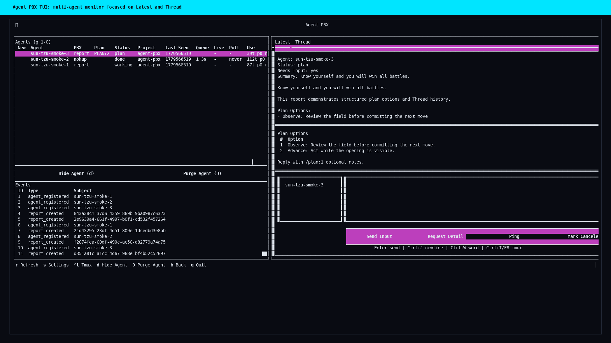

# Agent PBX

<p align="center">
  
</p>

Agent PBX is a local/LAN MCP service for collecting agent turn reports, storing
full response details, and queuing follow-up commands for agents to poll.

The name borrows from telephony. A PBX, traditionally a private branch exchange,
is a switchboard that routes calls between extensions and outside lines. Agent
PBX applies that pattern to agent sessions: agents report into one hub,
operators review the shared history, and follow-up commands are routed back to
the right agent.

## Install

### One-line release install

When release artifacts are published, install the latest wheelhouse with:

```bash
curl -fsSL https://github.com/m4xx3d0ut/agent-pbx/releases/latest/download/install-agent-pbx.sh | sh
agent-pbx --version
```

Set `AGENT_PBX_INSTALL_BASE_URL` when hosting the same artifacts somewhere else.

### Install from downloaded artifacts

Download both release assets into the same directory:

```text
install-agent-pbx.sh
agent-pbx-wheelhouse.tar.gz
```

Then install from that local artifact directory:

```bash
chmod +x install-agent-pbx.sh
AGENT_PBX_INSTALL_BASE_URL="file://$(pwd)" ./install-agent-pbx.sh
agent-pbx --version
```

The installer uses the active virtual environment when `VIRTUAL_ENV` is set.
Otherwise it creates a standalone venv under
`${XDG_DATA_HOME:-~/.local/share}/agent-pbx` and writes an `agent-pbx` wrapper
and an `agent-pbx-tui` wrapper to `~/.local/bin`.

### Build and install from a local wheelhouse

```bash
scripts/build_wheelhouse.sh --out dist/agent-pbx-wheelhouse
python -m venv .venv
source .venv/bin/activate
python -m pip install --no-index --find-links dist/agent-pbx-wheelhouse agent-pbx
agent-pbx --version
```

The build script also writes `dist/agent-pbx-wheelhouse.tar.gz` and
`dist/install-agent-pbx.sh` for release upload.

Release bundles should include:

```text
install-agent-pbx.sh
agent-pbx-wheelhouse.tar.gz
```

## Development

```bash
python3 -m venv .venv
source .venv/bin/activate
python -m pip install -e ".[dev]"
python -m pytest
agent-pbx mcp serve --host 127.0.0.1 --port 8765
```

The server defaults to localhost. LAN binding requires bearer-token
authentication and explicit operator intent. Runtime tokens and paired tokens
are admin/operator tokens for the PBX service: a holder can use both API and MCP
control surfaces. Role-scoped operator and agent tokens are future hardening
work for less-trusted LAN deployments.

## Local Environment

Use `local.env.example` as the template for machine-specific MCP and client
defaults. From a source checkout, keep a repo-local config in `local.env`:

```bash
cp local.env.example local.env
$EDITOR local.env
source ./local.env
```

For a user/global install, copy the same file to the XDG user config path:

```bash
mkdir -p ~/.config/agent-pbx
cp local.env.example ~/.config/agent-pbx/local.env
chmod 600 ~/.config/agent-pbx/local.env
$EDITOR ~/.config/agent-pbx/local.env
```

The installed `agent-pbx` command automatically reads
`${XDG_CONFIG_HOME:-~/.config}/agent-pbx/local.env` before parsing command
defaults. Override the path with `AGENT_PBX_CONFIG=/path/to/local.env` or skip
it with `AGENT_PBX_NO_CONFIG=1`. Shell environment variables and explicit CLI
flags still take precedence over file values.

Both `local.env` paths are intentionally private because they may contain local
tokens, Joplin credentials, and absolute executable paths. Common values include
`AGENT_PBX_HOST`, `AGENT_PBX_PORT`, `AGENT_PBX_TOKEN`,
`AGENT_PBX_SERVER_URL`, `AGENT_PBX_DEBUG`, `AGENT_PBX_WORKERBEE_BIN`, and the
optional Pull Request, Issues, GitHub remote/SSH, and Joplin settings.
TUI operator and tmux launch defaults are configured with
`AGENT_PBX_TUI_OPERATOR_CWD`, `AGENT_PBX_TUI_CODEX_BIN`,
`AGENT_PBX_TUI_OPERATOR_TMUX_SESSION`, `AGENT_PBX_TUI_CALLER_TMUX_SESSION`,
`AGENT_PBX_TUI_OPERATOR_REVIEW_ROOT`, and
`AGENT_PBX_TUI_REVIEW_MCP_APPROVAL_SERVERS`.

For the common local workflow:

```bash
source .venv/bin/activate
source ./local.env
agent-pbx mcp restart
agent-pbx mcp status
codex mcp add agent-pbx --url "$AGENT_PBX_MCP_URL" \
  --bearer-token-env-var AGENT_PBX_TOKEN
agent-pbx tui
```

`agent-pbx mcp restart` preserves the previous daemon host and port when
`--host`, `--port`, `AGENT_PBX_HOST`, and `AGENT_PBX_PORT` are not provided.
This avoids accidentally moving a LAN-bound daemon back to localhost during a
restart. Explicit flags and sourced `local.env` values still take precedence.

## Portable TUI Launcher

Use `agent-pbx-tui` for TUI-only clients on another local machine or small LAN
terminal. It reads a local dotenv-style config before launching, so the server
address and token do not need to be typed every time:

```bash
agent-pbx-tui --init-config
$EDITOR ~/.config/agent-pbx/tui.env
agent-pbx-tui
```

Set the MCP/API host by IP or DNS name and keep the token private:

```text
AGENT_PBX_SERVER_URL=http://192.168.29.111:8767
AGENT_PBX_TOKEN=dev-token
AGENT_PBX_TUI_LAYOUT=tiny
AGENT_PBX_TUI_THEME=cyberpunk
AGENT_PBX_TUI_LOW_POWER=1
AGENT_PBX_TUI_TMUX=0
```

The default config path is
`${XDG_CONFIG_HOME:-~/.config}/agent-pbx/tui.env`; override it with
`AGENT_PBX_TUI_CONFIG=/path/to/tui.env` or `agent-pbx-tui --config
/path/to/tui.env`. Environment variables override config values, and
`agent-pbx-tui --server ... --token ...` overrides both. The config parser
supports `KEY=value`, `export KEY=value`, shell-style quotes, comments, and
`${VAR}` references without executing the file as a shell script.

## Background MCP Daemon

Start the shared local MCP daemon in the background:

```bash
agent-pbx mcp start
```

The daemon stores its SQLite DB, metadata, and logs under
`${AGENT_PBX_HOME:-${XDG_DATA_HOME:-~/.local/share}/agent-pbx}` by default. Use
`agent-pbx mcp status`, `agent-pbx mcp restart`, and `agent-pbx mcp stop` for
lifecycle management. Use `agent-pbx mcp serve` or the compatibility command
`agent-pbx serve` only when you want a foreground/debug process.

`agent-pbx mcp status` prints the MCP URL, health URL, DB path, log path,
metadata path, and a Codex connection command. It also accepts `--token` as a
no-op compatibility flag, which keeps copied lifecycle commands symmetrical
with `start`, `restart`, `tui`, and UAT commands:

```bash
codex mcp add agent-pbx --url http://127.0.0.1:8765/mcp \
  --bearer-token-env-var AGENT_PBX_TOKEN
```

If the requested port is already in use, `agent-pbx mcp start` fails fast. Stop
the owning process or choose another port with `--port`. After an editable
reinstall, restart the daemon so it serves the new code:

```bash
agent-pbx mcp restart
agent-pbx mcp status
```

## Agent Instructions

Agent PBX can print or install the AGENTS.md wording that tells Codex-style
agents how to register, report, poll, and handle queued operator commands.

```bash
agent-pbx agent instructions
agent-pbx agent install --check --target AGENTS.md
agent-pbx agent install --append --target AGENTS.md
agent-pbx agent install --append --allow-create --target AGENTS.md
```

For deeper behavior guidance, print the runbook:

```bash
agent-pbx agent runbook
```

Connected agents can also call `pbx_agent_runbook` over MCP. The runbook is
intended for project-specific agent docs and for agents that need a refresher on
session-long PBX behavior.

Agent PBX has two operator-facing modes:

- `use Agent PBX`: report mode. Agents register with
  `metadata.pbx_mode="report"` and send meaningful `pbx_report_turn` updates.
  They must not call `pbx_poll_commands` or claim queued command pickup.
- `use Agent PBX nohup`: nohup mode. Agents register or update metadata with
  `pbx_mode="nohup"` and `pbx_nohup_explicit=true`, report status, poll queued
  commands, ack handled commands, honor pings, and open post-reply follow-up
  windows.

Registration still defaults `pbx_active=true`, which means Agent PBX visibility
is on. `pbx_active=false` means PBX is off for either mode. The guidance
requires `status="done"` reports for repository work to include whether changes
are clean, committed, staged, or unstaged. It also requires normally progressing
long-running work to check in with `status="working"` at least once every five
minutes.

In nohup mode, after a terminal reply, agents should open one bounded
post-reply follow-up window:

```python
pbx_poll_commands(
    agent_id="codex-main",
    wait_seconds=25,
    max_wait_seconds=600,
    interval_seconds=5,
)
```

That repeats long-poll cycles for up to ten minutes after `done`, `complete`,
`completed`, `failed`, `canceled`, or `blocked` reports, so follow-ups queued
after the reply can still be picked up by a live nohup-mode agent. If the 600s
window returns empty, the agent should stop polling until the next explicit PBX
action or new work.

Agents should open that post-reply window only after the operator explicitly
asked for `use Agent PBX nohup`. In report mode, including local tmux-direct
workflows, agents should send the terminal report and stop without long polling.

Use `Ping` in the TUI to intentionally keep a live nohup-mode agent polling
longer. Agents handle `ping` as a keepalive: reply with a `status="working"`
pong report, ack with `{"pong": true}`, then start another 300s bounded poll
window. Each ping extends polling in five-minute increments. In report mode,
`Ping`, `Request Detail`, `Send Input`, and queued plan replies wait in the PBX
queue until the agent polls; use tmux direct mode for no-poll local interaction.

When an operator asks an agent to stop using PBX, the agent should send a final
report, call `pbx_set_active(active=false)`, and stop PBX reporting and any
polling until a new PBX session starts. The TUI `PBX` column shows `report`,
`nohup`, or `off`.

The TUI `Use` column shows a rough PBX-visible usage gauge per agent for the
last hour: estimated tokens plus poll, report, and ping counts. Estimates use
payload text size and fixed weights for polling overhead; they are not exact
Codex billing, but they identify noisy agents and verbose check-ins.

## Operator Agents and Campaigns

Agent PBX supports two agent types. Existing sessions default to
`agent_type="caller"`. The TUI can also start an `agent_type="operator"` from a
caller by forking that caller's current Codex session with `codex fork`. A
logical operator can own a default/edit fork plus multiple read-only review
forks for the same caller. Review forks use `fork_track_id` values such as
`review-1`, `fork_purpose="review"`, `access_mode="review_readonly"`, and a
scratch `work_root` outside the caller's source checkout.

Caller sessions must register `metadata.cwd` and `metadata.codex_session_id`
before Agent PBX can create a fork. V1 fork creation is local-only: if a caller
session is on another host, Agent PBX records a blocked fork state instead of
guessing or using `codex fork --last`.

When a caller restarts its Codex session, Agent PBX can rebind one stale live
fork to the new `metadata.codex_session_id` if the logical operator, caller,
source cwd, host, and fork track match. If multiple candidates match, the fork
is left blocked so the operator can resolve the association explicitly.

Campaign state is stored in dedicated SQLite tables for fast TUI/API queries:
`operator_campaigns`, `operator_campaign_assignments`, and
`operator_campaign_events`. Fork state and optional planning DAG links are
stored in `operator_forks` and `operator_fork_edges`. Knowledge-link context is
stored in `operator_knowledge_links` and `operator_knowledge_turns`; executable
operator-to-operator handoffs are stored in `operator_handoffs`. Handoffs track
approval, required target fork launch, delivery evidence, receiver
acknowledgement, started/running state, TTL expiry, artifact summaries, and
terminal status without creating fork edges or changing source-session
ownership. Durable operator knowledge is stored in `operator_kb_entries`,
`operator_kb_sources`, and `operator_kb_events` after root-operator review;
manual seed-run provenance is stored in `operator_kb_seed_runs`. Full-text and
semantic-lite search state is maintained through `operator_kb_index_jobs`, the
SQLite FTS table, and hashed-signature chunk rows in `operator_kb_chunks`, so KB
search remains portable with the PBX database and does not require a vector
service.
Reports and commands still provide the audit trail and link back to
campaigns with report metadata and command payload fields such as
`campaign_id`, `assignment_id`, `operator_agent_id`, and `operator_fork_id`.

The operator loop is:

1. Call `pbx_operator_runbook`.
2. Start a campaign with title, objective, criteria, and one assignment per
   caller.
3. On first interaction with each caller, create or reuse the caller's default
   forked operator session, or create a dedicated review fork for read-only
   review work.
4. Dispatch and follow up through the fork session. `delivery="auto"` queues
   nohup forks and uses tmux for report-mode forks.
5. Review caller and fork threads, send follow-ups, and report each assignment as
   complete, blocked, or needing follow-up.
6. Finish the campaign when all assignments have explicit final states.

The TUI `Campaigns` tab shows operator-owned campaigns and generated report
detail. Use `View Report (R)` or `Shift+R` to inspect the selected campaign
report. Use `Copy Note (C)`, `Shift+C`, or `/campaign copy` to write the
selected campaign detail, including loaded generated reports, to a new Joplin
note when Joplin is configured.

The Operators pane keeps root operators and their fork sessions together. Use
`Review W`, press `W`, or run `/operator fork review` with a root operator or
its caller-scoped fork selected to create a read-only review fork in the
configured scratch work root. Use `Prev F6` and `Next F7` to cycle the visible
fork pane for the selected logical operator.

Review forks should treat the source checkout as read-only and write only under
their configured `work_root`. If a finding requires edits in the source repo,
route it with `pbx_operator_route_review_escalation` so the root operator or an
idle default/edit fork can handle it. If review work needs a new sibling
project, call `pbx_operator_request_project_spawn` with the project name,
instructions, and `mode` of `empty` or `clone_source`. The TUI/root operator
approves the oldest pending request with `Spawn P` or `/operator project spawn`;
Agent PBX then creates the sibling project at the same parent depth as the
source repo, starts a normal tmux caller Codex session there, and attaches it to
the Agents pane when it registers.

If review work needs to transfer domain context to another operator, the review
fork can call `pbx_operator_propose_knowledge_handoff` with the source review
fork agent, target operator agent, and handoff message. Metadata may include a
`target_caller_agent_id`, `allowed_mutation_scope`, `required_artifacts`,
redacted `artifact_bundle`, `expires_at`, `needs_ack`, and optional KB lookup
fields such as `kb_query`, `kb_project`, `kb_repo_root`, `kb_tags`, and
`include_kb_context=true`. When a KB query is present, Agent PBX attaches active
KB matches to the handoff metadata and delivered prompt before the receiving
operator starts. Review forks can list and inspect knowledge-link, handoff, and
KB context, but they cannot approve delivery or send unmediated knowledge turns.
The root operator/TUI uses
`/operator handoffs` to inspect pending handoffs and
`/operator handoff preflight` to dry-run pane readiness, queue/nohup routing,
required target-fork state, and attached KB context without sending anything.
Use `/operator handoff approve` to approve the oldest pending handoff. If the
target operator needs a caller fork that has not been launched, the handoff
moves to `pending_launch`; use `/operator handoff launch` to launch the
required fork and retry delivery. Agent PBX then sends a normal `send_input`
command or tmux direct message to the target operator without creating a fork
edge, campaign assignment, or source-session association.

Receiving operators should acknowledge handoffs with
`pbx_operator_ack_handoff`. Use `status="acknowledged"` after reading the linked
context and `status="running"` only after the target workflow actually starts.
Use `pbx_operator_update_handoff` for `blocked`, `failed`, `complete`, or other
terminal states. Delivery evidence distinguishes tmux/queue delivery from
receiver acknowledgement and start, so a pane paste is not treated as workflow
success by itself. Tmux evidence records the resolved pane, target command,
paste/send-key steps, and whether the target looked Codex-like; `submitted` is
only true for a Codex-like target.

When a knowledge link or handoff produces reusable operating guidance, review
forks and operators can propose KB entries with `pbx_operator_kb_propose` or
`pbx_operator_kb_propose_from_link`. Proposed entries stay scoped to the
creating logical operator until the root operator reviews and promotes them with
`pbx_operator_kb_promote`, `/operator kb promote`, or the `Promote` button in
the right-pane `KB` tab. Use `/operator kb proposed` or the `Proposed` filter to
inspect pending entries and select a row to review its body. Root operators can
edit entries with `pbx_operator_kb_update`, reject bad proposals with
`pbx_operator_kb_reject`, `/operator kb reject`, or `Reject`, and retire active
records with `pbx_operator_kb_retire`, `/operator kb retire`, or `Retire`.
Active KB entries are readable by other operators through
`pbx_operator_kb_search`, `pbx_operator_kb_context`, `pbx_operator_kb_get`, and
`/operator kb`. Handoff flows can request the same lookup by passing `kb_query`
or `include_kb_context=true` metadata. Context lookup defaults to project scope,
only narrows by repo path when `repo_root` or `kb_repo_root` is supplied, and
uses SQLite-local hybrid keyword/semantic retrieval unless `semantic=false` is
passed. Raw KB search remains keyword-first by default; pass `semantic=true` to
`pbx_operator_kb_search` or `/v1/operator/kb` when differently worded queries
should be considered. Returned entries include non-persistent retrieval evidence
under `metadata.retrieval`, including source type, score, and matched chunk
metadata.
KB lookups are also recorded as query history. Context responses and recorded
search results include `query_id` and per-entry `match_id` values so operators
can call `pbx_operator_kb_feedback` with `accepted`, `rejected`, `stale`,
`wrong_scope`, `unsafe`, or `miss`. Use `pbx_operator_kb_list_queries`,
`pbx_operator_kb_get_query`, `/operator kb history`, and `/operator kb misses`
to review prior searches, top matched chunks, feedback counts, and miss reports.
The TUI KB tab has a query box plus `Search`, `History`, `Misses`, `Useful`,
`Wrong`, and `Miss` controls for visual review.
Root operators can export portable
JSON-compatible KB bundles
with `pbx_operator_kb_export` and import them with `pbx_operator_kb_import`;
active import and promotion require clean redaction state or an explicit manual
override in metadata.

Operators can also compile proposed KB entries from normal working reports by
including report metadata under `operator_kb_candidates`, `kb_candidates`, or
`kb_proposals`. Each candidate is an object with `title`, `summary`, `body`, and
optional `scope`, `project`, `repo_root`, `git_remote`, `branch`, `tags`,
`stale_after`, `expires_at`, and `metadata`. The API and MCP report paths
auto-compile those candidates as proposed KB entries, dedupe them with a content
hash, attach the source report in `operator_kb_sources`, and keep promotion on
the root review path. Use `/operator kb compile` to manually retry compilation
for the selected operator's latest report, and `/operator kb reindex` to rebuild
the SQLite FTS and semantic chunk indexes.

Use `/operator kb seed` to manually ask the selected root operator or fork to
extract durable operating guidance from its current context. Agent PBX records a
seed run, delivers a normal `send_input` prompt by queue or tmux, and includes a
stable `seed_run_id` and `seed_sync_key` for future sync/dedupe. The receiving
operator searches existing KB entries, proposes small atomic entries with
`pbx_operator_kb_propose`, includes the supplied seed metadata, then marks the
run finished with `pbx_operator_kb_update_seed_run`. Seed runs create proposed
entries only; root promotion, rejection, retirement, import, and export stay on
the existing review path.

KB bodies and export bundles may contain private, proprietary, or personally
identifying context from operator handoffs. Keep exports under ignored local
paths such as `artifacts/`, `runs/`, or `state/`; repo ignore rules also exclude
root-level `*operator-kb*.json`, `*operator_kb*.json`, and
`agent-pbx-operator-kb*.json` bundle files.

Current semantic KB support is intentionally local and deterministic. It chunks
canonical KB text, stores hashed sparse term signatures, and combines those
scores with the existing keyword/FTS path. Retrieval feedback and query
observability are canonical SQLite records, while export/import continues to
move only reviewed KB entries. The practical roadmap from here is to tune
retrieval from accepted/rejected/miss history, then consider a true embedding
provider or graph edges only after retrieval quality gaps are visible in normal
operator work.

First use from a running tmux-mode TUI is: select the source caller, use
`Start O` or press `O` to ensure the logical operator exists, use `Review W` or
press `W` to create a read-only review fork, then prompt that review fork. When
the review fork requests a sibling project, select the operator and use
`Spawn P` or `/operator project spawn`; the spawned project should then appear
as a normal caller in the Agents pane after its Codex session registers. When a
review fork proposes a knowledge handoff, select the logical operator and run
`/operator handoffs` to inspect workflow state, `/operator handoff preflight`
to verify the target route, `/operator handoff approve` to approve delivery,
and `/operator handoff launch` if the target operator needs a caller fork
before the handoff can run. When that exchange produces durable guidance, run
`/operator kb seed` against the operator or fork that holds the context, then
run `/operator kb proposed` to open the `KB` tab on proposed entries, select
proposals to review their bodies, and use `Promote` to publish clean proposals
or `Reject` to reject them. If the operator already reported explicit KB
candidates, use `/operator kb compile` first, then review the proposed entries
in the same tab.

## Planned Local Validation

WorkerBee is used to rebuild and run the containerized MCP/API service with simulated agents and clients. Repository-owned WorkerBee manifests live under `ops/workerbee/`.

```bash
docker build -t agent-pbx:workerbee .
docker run --rm -p 8765:8765 -e AGENT_PBX_TOKEN=dev-token agent-pbx:workerbee
agent-pbx sim-agent --token dev-token --once
agent-pbx sim-client --token dev-token --agent-id sim-agent-1 --message "Proceed"
```

For a bounded operator KB/handoff UAT run against a live daemon, use the
reusable harness. Synthetic agents and reports include suppressed TUI alerts,
and cleanup hides synthetic agents plus retires/rejects generated KB proposals.
Every run writes a private manifest under the Agent PBX state root so cleanup
can be retried if the process is interrupted:

```bash
agent-pbx uat operator-kb-flow --server http://127.0.0.1:8765 --token dev-token
agent-pbx uat operator-kb-flow --server http://127.0.0.1:8765 --token dev-token \
  --tmux-sink --tmux-session auto --output runs/operator-kb-flow.json
agent-pbx uat cleanup --run kb-sim-YYYYMMDDHHMMSS-xxxxxxxx --token dev-token
agent-pbx uat operator-kb-flow --ci --server http://127.0.0.1:8765 --token dev-token
agent-pbx uat operator-kb-flow --from-stage 6 --ci \
  --server http://127.0.0.1:8765 --token dev-token
agent-pbx uat compare --run kb-sim-old --run kb-sim-new
```

The tmux profile preflights server health, controlled cwd, tmux binary, and the
target tmux session before creating synthetic operators. `--tmux-session auto`
prefers `AGENT_PBX_TUI_OPERATOR_TMUX_SESSION`, then `agent-pbx`, then
`agent-pbx-operators`, and reports a warning if it has to fall back. The `--ci`
profile disables tmux delivery and forces cleanup, which keeps the harness
suitable for automated test jobs that only need API-level validation. Use
`--output path.json` to preserve the complete run evidence while keeping the
terminal summary compact.

Use `--stage N` to run one logical UAT stage plus required setup, or
`--from-stage N` to run the later-stage slice plus setup. `--skip-tmux` disables
tmux delivery even when a copied command includes `--tmux-sink`. Stage 6 covers
negative-path recovery checks: expired handoffs, missing target forks,
preflight timestamp readiness, non-Codex tmux evidence, and idempotent cleanup
expectations. Stage 7 covers a record-only multi-operator lifecycle where a
third operator resolves KB context, acknowledges, runs, completes, and avoids
unwanted fork/source-session associations. Stage 8 validates SQLite-native
semantic KB retrieval: keyword-only search misses a differently worded query,
hybrid search finds the promoted KB entry, and handoff metadata can attach that
semantic context. Stage 9 records accepted retrieval feedback, records a miss,
lists query history and miss reports, fetches match/chunk detail, and verifies
portable KB export still omits query-history and feedback observability records.

Successful cleanup is followed by an audit that checks for visible synthetic
agents, active UAT KB leaks, non-terminal UAT handoffs, and live UAT tmux
panes. `agent-pbx uat compare --run A --run B` reads persisted manifests and
reports check, failure, warning, duration, cleanup, and report-drift deltas.

The TUI handoff list shows the latest recorded delivery preflight age/warnings
and a lightweight ack monitor for sent handoffs. Approving a pending handoff
runs preflight first and records that preflight in the handoff metadata before
delivery.

## WorkerBee TUI Status

Set `AGENT_PBX_WORKERBEE_BIN` before starting the Agent PBX daemon to enable
the read-only WorkerBee tab in the TUI. The daemon runs WorkerBee status
commands; the TUI only renders the API result.

```bash
export AGENT_PBX_WORKERBEE_BIN=/home/m4xx3d0ut/git/k1s-wt/k1s-workerbee/.venv/bin/workerbee
export AGENT_PBX_WORKERBEE_TIMEOUT_SECONDS=20
agent-pbx mcp restart --token dev-token
agent-pbx tui --token dev-token
```

Agents must register with `metadata.cwd` set to their project directory. When
the selected agent is in a WorkerBee project, the tab shows the WorkerBee
project name, mode, running state, dashboard URLs, app readiness, latest
deployment metadata, ingress URLs, workloads, and validation findings. The v1
tab does not start, stop, deploy, or mutate WorkerBee projects.
`AGENT_PBX_WORKERBEE_TIMEOUT_SECONDS` defaults to `20` because `workerbee
projects` can take more than ten seconds on hosts with many projects. Agent PBX
also serializes same-agent WorkerBee checks and caches results briefly to avoid
WorkerBee project-lock collisions from repeated refreshes.

## Pull Request Review

Set `AGENT_PBX_PR_ENABLED=1` before starting the daemon to enable the `PRs` tab
for selected agents whose `metadata.cwd` is inside a GitHub repository. Agent
PBX uses the authenticated `gh` CLI on the MCP host; remote TUI clients only see
Agent PBX API results.

```bash
export AGENT_PBX_PR_ENABLED=1
export AGENT_PBX_GH_BIN=gh
export AGENT_PBX_PR_ALLOWED_REPOS=m4xx3d0ut/agent-pbx,the-cm-collective/k1s-private,the-cm-collective/k1s-workerbee-private
# Optional, only when gh cannot infer the intended GitHub repository.
export AGENT_PBX_GITHUB_REMOTE=upstream
# Optional, only when GitHub access needs a specific SSH identity.
export AGENT_PBX_GITHUB_SSH_COMMAND="ssh -i $HOME/.ssh/github-key -o IdentitiesOnly=yes -o IdentityAgent=none"
agent-pbx mcp restart --token dev-token
agent-pbx tui --token dev-token
```

The `PRs` tab lists open pull requests, status checks, details, changed files,
and URLs for the selected agent project. `Review` asks the selected agent to
review the PR; `Validate` asks it to run appropriate WorkerBee checks and report
results. In tmux direct mode these prompts are sent straight to the Codex pane.
Otherwise they are queued as `send_input` commands, so the target agent must be
polling in `use Agent PBX nohup` mode before the request can produce a new
Latest/Thread report. Agents can call `pbx_pr_context(agent_id, pr_number)` for
read-only PR context, but there is no agent-side merge tool.

Merging is operator-only and disabled by default. To expose the TUI/API merge
button, set `AGENT_PBX_PR_MERGE_ENABLED=1`; the merge request still requires
the server token and exact confirmation text such as `merge PR #12`. Use
`AGENT_PBX_PR_ALLOWED_REPOS` as a comma-separated allowlist for LAN lab runs.
If the PR tab reports that a repository is not allowed, add that `owner/repo`
value to the list or leave the variable empty to allow any repo visible to
`gh` on the MCP host.

By default, Agent PBX lets `gh` infer the GitHub repository from the selected
agent's working directory. If a project has multiple remotes and `gh` would pick
the wrong one, set `AGENT_PBX_GITHUB_REMOTE` to the remote name that points at
GitHub. Agent PBX then resolves `owner/repo` from that remote and passes
`--repo owner/repo` to `gh`. If GitHub SSH needs a specific key, set
`AGENT_PBX_GITHUB_SSH_COMMAND`; for repository-specific keys, set
`AGENT_PBX_GITHUB_SSH_COMMAND_OVERRIDES_JSON='{"owner/repo":"ssh ..."}'`.
Per-repo overrides take precedence over the global SSH command. The daemon
status reports whether an SSH command is configured, but does not expose the
command string.

## GitHub Issues

Set `AGENT_PBX_ISSUES_ENABLED=1` before starting the daemon to enable the
`Issues` tab for selected agents whose `metadata.cwd` is inside an allowed
GitHub repository. Issues reuse `AGENT_PBX_GH_BIN`,
`AGENT_PBX_PR_TIMEOUT_SECONDS`, `AGENT_PBX_PR_ALLOWED_REPOS`, and the GitHub
remote/SSH settings from the PR integration.

The `Issues` tab lists open issues and shows issue body, labels, assignees,
milestone, URL, and recent comments. `Mitigate` asks the selected agent to
investigate and report a fix path. In tmux direct mode the prompt is sent
straight to the Codex pane; otherwise it is queued as `send_input` and requires
the target agent to poll in `use Agent PBX nohup` mode.

Clearing is operator-only and disabled by default. To expose the TUI/API clear
action, set `AGENT_PBX_ISSUES_CLOSE_ENABLED=1`; each clear still requires a
mitigation summary comment and exact confirmation text such as
`clear issue #12`. Agents can call `pbx_issue_context(agent_id, issue_number)`
for read-only context, but there is no agent-side close/comment tool.

## Joplin Notes Integration

Set `AGENT_PBX_JOPLIN_API_URL` and `AGENT_PBX_JOPLIN_TOKEN` before starting the
Agent PBX daemon to enable the optional `Joplin` tab and MCP document export
tools. Credentials stay server-side; remote TUI clients only read Agent PBX API
results.

```bash
export AGENT_PBX_JOPLIN_API_URL=http://127.0.0.1:41184
export AGENT_PBX_JOPLIN_TOKEN=<joplin-api-token>
export AGENT_PBX_JOPLIN_NOTEBOOK="Agent PBX"
export AGENT_PBX_JOPLIN_BIN="$HOME/.joplin-bin/bin/joplin"
export AGENT_PBX_JOPLIN_PROFILE="$HOME/.config/joplin-agent-pbx"
export AGENT_PBX_JOPLIN_SYNC_ON_WRITE=1
agent-pbx mcp restart --token dev-token
agent-pbx tui --token dev-token
```

Agent PBX writes notes through the local Joplin REST API. To queue WebDAV syncs
after writes, enable `AGENT_PBX_JOPLIN_SYNC_ON_WRITE=1` and provide a Joplin CLI
path/profile. After each create, edit, delete, COPY note, or LOG append, Agent
PBX records a durable SQLite sync job and a background worker runs
`joplin --profile <profile> sync`. Note writes return before WebDAV sync
finishes. Leave this off if a separate Joplin client or background process
already syncs the profile.
If WebDAV sync uses E2EE, the dedicated profile must have its master key loaded;
otherwise Joplin may exit successfully while reporting `Master key is not
loaded`, and Agent PBX will surface that as a sync failure.

When first used, Agent PBX lazily creates one top-level Joplin notebook, then
nests notes as `project > agent`. Note titles use
`session-id-YYYYmmddTHHMMSSZ-COPY|LOG|DOC`. `Copy Latest` writes the selected
agent's latest report to a new Markdown note. The `Campaigns` tab can also copy
the selected campaign and its generated report detail to a new Markdown note
with `Copy Note (C)` or `/campaign copy`. `Start LOG` creates a growing log
note and appends queued operator prompts plus terminal agent responses until
`Stop LOG` is pressed. In tmux direct mode, an active LOG appends prompts sent
through Agent PBX, waits for the tmux pane to settle, then asks Codex for
`/copy` and appends the copied response. The tab also lists scoped notes,
previews Markdown, and supports quick create, rename, delete, and save controls
inside the Agent PBX notebook scope only.

The Joplin tab status line shows queued, running, successful, and failed sync
state. Press `Sync Now` or use `/joplin sync` to queue a manual sync. Sync
failures are retained in Agent PBX status/events; they do not roll back the note
write that triggered them.

Joplin actions are available from the tab buttons and the local TUI
palette/slash commands: `/joplin` opens the tab, `/joplin refresh` reloads
scoped notes, `/joplin new` creates a scoped note, `/joplin rename` renames the
selected note, `/joplin delete` confirms and deletes the selected scoped note,
`/joplin copy` copies the latest Codex response in tmux direct mode, `/joplin
copy report` copies the latest PBX report, `/joplin log start` and `/joplin log
stop` control the growing LOG note, `/joplin save` saves the selected note body,
and `/joplin sync` queues a manual sync job.

The Joplin tab buttons show their shortcut key directly, such as `New n` and
`Copy c`. Press `Ctrl+G` then that key; when focus is outside an editable note
body, `j` can be used instead of `Ctrl+G`.

In tmux direct mode, `/joplin copy` sends Codex `/copy` to the selected pane,
reads the copied response with a local clipboard helper such as `wl-paste`,
`xclip`, `xsel`, `pbpaste`, `termux-clipboard-get`, or `tmux show-buffer`, then
creates a Markdown COPY note with the last prompt recorded by the TUI and the
copied response. If no clipboard reader is available, use `/joplin copy report`
or configure clipboard integration for the terminal/tmux session. The tmux LOG
path uses the same `/copy` and clipboard helper flow; it does not append guessed
screen text when clipboard capture fails.

Agents can call `pbx_joplin_status` and `pbx_joplin_create_document` when the
operator asks for a Markdown note or document. Mermaid diagrams should be passed
as fenced Mermaid blocks so Joplin can render them safely. Default tests use a
fake Joplin API; for end-to-end development, run a disposable Joplin profile.

Configure WebDAV and end-to-end encryption in Joplin itself, then keep Agent PBX
pointed at the local REST API. Do not persist WebDAV or E2EE decrypt passwords in
`local.env`; enter them interactively in the dedicated Joplin profile or use an
external secret helper outside Agent PBX. A headless profile can be run in tmux:

```bash
joplin --profile ~/.config/joplin-agent-pbx
# Inside Joplin: :config sync.target 6
# Inside Joplin: :sync
# If encrypted: :e2ee decrypt
# Inside Joplin: :server start
```

For E2EE troubleshooting from a shell:

```bash
joplin --profile ~/.config/joplin-agent-pbx e2ee status
joplin --profile ~/.config/joplin-agent-pbx
# Inside Joplin: :e2ee decrypt
# Then retry: :sync
```

The Joplin API token is still sensitive. Store it only in
`${XDG_CONFIG_HOME:-~/.config}/agent-pbx/local.env` or repo-local `local.env`
with `chmod 600`, and treat the Joplin profile directory as private.

## Files TUI Browser

The TUI includes a read-only `Files` tab for the selected agent project. Agents
must register with `metadata.cwd`; Agent PBX lists files relative to that
directory and rejects absolute paths, parent traversal, and symlink escapes.
Generated or noisy directories such as `.git`, `.venv`, `node_modules`,
`artifacts`, and `runs` are hidden by default.

Selecting a text file shows a bounded text preview. PNG images and GIF first
frames render as a terminal-native color block preview plus a grayscale text
fallback when Agent PBX can decode them; other binary files and unsupported
image formats show metadata such as size, MIME type, and image dimensions when
detectable. Install `agent-pbx[images]` to enable optional Pillow decoding for
additional formats such as JPEG and WebP. If `chafa` is installed on the host,
Agent PBX can use it as a best-effort fallback renderer. The preview avoids
terminal-specific image protocols, so it works across desktop terminals, SSH,
tmux, and Termux.

The Latest input can complete project paths with `@`. Type a project-relative
reference such as `@README` or `@src/ag` and press `Tab`; Agent PBX loads the
needed project directory before completing. The same completion works in tmux
direct input.

Joplin project notes can be referenced with `@joplin:`. Type
`@joplin:Release` and press `Tab` to complete project note titles; if the
Joplin tab has not been opened yet, Agent PBX lazily loads the selected
project's note index first. On send, Agent PBX fetches each referenced note body
fresh and appends a `Joplin Note References` Markdown section to the prompt, so
`Review @joplin:weekly-updates-052926-060826 and @joplin:Release-Checklist`
gives Codex both note bodies in one message. If a referenced note cannot be
resolved inside the selected project scope, the prompt is not sent. Reference
tokens are exact note slugs; use `Tab` completion when title wording is unclear.

Operator prompts can reference caller agents with `@caller:`. Select an
operator agent, type `@caller:project` or `@caller:Backend`, and press `Tab` to
complete known caller agents from the Agents table. When an operator prompt
uses `@caller:`, following `@joplin:` references resolve in that caller's
project note scope until another `@caller:` appears. For example,
`@caller:api @joplin:Runbook @caller:web @joplin:Runbook` can attach two
different Runbook notes from two caller projects. On send, a `@caller:`
reference creates or reuses that caller's fork, keeps the prompt on the root
operator session, and appends a `Caller Agent References` Markdown section with
the exact `agent_id`, project, PBX mode, status, active campaign count, active
fork identity, and tmux pane when known.

Operator prompts can also reference GitHub pull requests and issues with
`@pr:<number>` and `@issue:<number>`, or natural references such as `PR #7`,
`pull request #7`, and `issue #12`. These references scope to the nearest
preceding `@caller:` token. If the operator was started from a caller, that
caller is implied, so `Review PR #7 and assess issue #12.` loads context from
the source caller's repository without an explicit caller tag. If an operator
has no implied source and a prompt contains exactly one `@caller:`, PR or issue
references before that tag also use that caller, so `Review PR #7 for
@caller:api and assess issue #12` works as expected. Prompts may mix multiple
caller scopes; Agent PBX fetches read-only PR and issue detail before send and
appends a `GitHub PR and Issue References` Markdown section.

The `Joplin` tab lists notes from the selected project folder and its
descendants under the Agent PBX notebook. That means notes created directly in
Joplin under the project can be opened, edited, renamed, saved, deleted, and
referenced from Agent PBX. COPY and LOG actions still create agent/session
notes so response captures and growing logs remain attributable to a specific
agent run.

## Debug Runs

Use `--debug` on the foreground server or daemon for verbose PBX request and
MCP tool logs. Use `--transcript` on simulator commands to write JSONL CLI
transcripts:

```bash
agent-pbx mcp serve --debug --token dev-token
agent-pbx sim-agent --token dev-token --transcript runs/sim-agent.jsonl
agent-pbx sim-client --token dev-token --agent-id sim-agent-1 \
  --message "Proceed" --transcript runs/sim-client.jsonl
```

For a bounded TUI smoke feed, add `--debug-smoke` or set
`AGENT_PBX_DEBUG_SMOKE=1`. This registers `sun-tzu-smoke-1` through
`sun-tzu-smoke-3`, emits one or two short Sun Tzu quote reports immediately and
then every random 30-60 seconds, and stops after five minutes.

```bash
agent-pbx mcp start --debug --debug-smoke --token dev-token
```

## TUI Notifications

The TUI keeps visual flash and terminal bell notifications off by default for
the localhost workflow. Enable either at launch with environment variables:

```bash
AGENT_PBX_TUI_FLASH=1 agent-pbx tui --token dev-token
AGENT_PBX_TUI_BELL=1 agent-pbx tui --server http://192.168.1.25:8765 \
  --token dev-token
```

For a local container image, bake defaults in with build args:

```bash
docker build --build-arg AGENT_PBX_TUI_FLASH=1 \
  --build-arg AGENT_PBX_TUI_BELL=1 \
  --build-arg AGENT_PBX_TUI_AGENT_BLINK=1 \
  --build-arg AGENT_PBX_TUI_THEME=1337 \
  --build-arg AGENT_PBX_TUI_CUSTOM_THEME_NAME=1337 \
  -t agent-pbx:tui .
```

The same options are available from the TUI `Settings` screen with the `s`
hotkey. Alerts fire for new agent registrations, new reports, and command
acknowledgements. The Agents table also highlights unseen latest reports with
`NEW`, and the top alert bar blinks for unseen latest reports by default. Click
the blinking alert to jump directly to the first unseen agent's `Latest` tab.
Disable that with `AGENT_PBX_TUI_AGENT_BLINK=0` or the `Unseen blink` setting.

The TUI layout defaults to `adaptive`: wide terminals use a side-by-side
Agents/right-pane split, narrow terminals use compact full-width agent views,
and very small terminals use a tiny mode that shows only Agents or Events on
the home screen. Override with
`AGENT_PBX_TUI_LAYOUT=adaptive|split|compact|tiny` or the `Layout` setting.
Selecting an agent in compact or tiny mode opens a full-width view with
`Latest`, `Thread`, `Files`, `WorkerBee`, `PRs`, `Issues`, `Campaigns`, and
configured optional tabs such as `Joplin`; press `b` to return to the agent
list. In tiny mode, press `e` on the home screen for Events and `a` to return
to Agents.

For very low-power terminals where the TUI is mostly an alert board, enable
low-power watch mode. It keeps server event alerts active, slows periodic
safety refreshes, avoids rendering hidden Events in tiny mode, and skips hidden
selected-agent detail refreshes until you open an agent:

```bash
AGENT_PBX_TUI_LAYOUT=tiny \
AGENT_PBX_TUI_THEME=cyberpunk \
AGENT_PBX_TUI_TMUX=0 \
AGENT_PBX_TUI_LOW_POWER=1 \
AGENT_PBX_TUI_AGENT_REFRESH_SECONDS=15 \
AGENT_PBX_TUI_ATTENTION_BLINK_SECONDS=3 \
agent-pbx tui --server http://192.168.1.25:8767 --token "$AGENT_PBX_TOKEN"
```

In split layout, adjust the Agents/right-pane width with `[` and `]`; press
`0` to reset to the default 42% Agents width. The same controls are available
from Settings, and `AGENT_PBX_TUI_SPLIT_PERCENT=25..75` can set the launch
default. Mouse-drag splitters are intentionally deferred because the current
Textual version does not provide a native splitter and keyboard controls work
better over SSH and mobile terminals.

Use `g` followed by `1` through `9` to jump directly to the first nine visible
agents' `Latest` tabs; `g` then `0` jumps to the tenth visible agent. The
sequence is ignored while typing in follow-up inputs, avoiding terminal
`Alt+number` tab-switching conflicts.

Press `p` from the Agents table, or use `Star/Unstar`, to pin an agent near the
top of the Agents list. Starred agents are sorted by latest activity above
unstarred agents, which are also sorted by latest activity. Star selections
sync through the Agent PBX server so a workstation TUI and a remote watch TUI
show the same pinned agents; the TUI settings file keeps a local cache/fallback.
Press `h` or `Show Hidden` to include hidden agents in the Agents table; hidden
rows show a `Hidden` marker. Select a hidden row and press `H` or `Unhide` to
restore it without waiting for the agent to reconnect.

For high-volume cleanup, use `Prune` or `/agents prune` to preview a reversible
batch hide of old unstarred terminal caller sessions. The default preset keeps
starred agents, operators, operator forks, queued agents, active campaigns, and
agents involved in active operator forks, handoffs, knowledge links, or project
spawn requests. `/agents prune apply` applies the latest preview using fresh
live state, and `/agents prune undo` restores the latest unapplied batch.
`/agents prune stale` previews old stale nonterminal callers, and
`/agents prune forks` previews old operator forks only when they have no
recorded tmux pane and no active operator relationship. Bulk prune is hide-only;
bulk thread purge is intentionally not supported.

Press `Ctrl+P` to open the command palette. Agent PBX adds slash-style operator
commands such as `/detail`, `/ping`, `/esc`, `/ctrlc`, `/restart`, `/tmux`,
`/workerbee`, `/campaigns`, `/campaign report`, `/campaign copy`,
`/operator fork prev`, `/operator fork next`, `/operator fork review`,
`/operator handoffs`, `/operator handoff preflight`, `/operator handoff approve`,
`/operator handoff launch`, `/operator knowledge links`, `/operator knowledge send`,
`/operator kb`, `/operator kb detail`, `/operator kb proposed`,
`/operator kb proposed detail`, `/operator kb seed`, `/operator kb compile`,
`/operator kb reindex`, `/operator kb promote`, `/operator kb reject`,
`/operator kb retire`, `/operator project spawn`, `/pr`, `/pr refresh`,
`/pr review`, `/pr validate`, `/pr url`, `/pr merge`, `/issue`, `/issue refresh`, `/issue mitigate`,
`/issue url`, `/issue clear`, configured `/joplin`, `/joplin new`,
`/joplin rename`, `/joplin delete`, `/joplin copy`,
`/joplin copy report`, `/agents prune`, `/agents prune apply`,
`/agents prune stale`, `/agents prune forks`, `/agents prune undo`,
`/show hidden agents`, `/unhide agent`, `/theme minimal`, and
`/layout compact`.
`/cancel` marks a stale or abandoned session canceled in PBX; it does not send
an Escape key. Use `/esc` when you need a real Escape key event. In tmux direct
mode, `/esc` sends `tmux send-keys Escape` to the selected Codex pane. Outside
tmux direct mode, it queues a `send_key` command with `key="escape"` for
nohup-mode agents that poll PBX. Use `/ctrlc` in tmux direct mode to send
`tmux send-keys C-c` to the selected Codex pane, for example to back out of a
`/side` chat. Use `/restart` or `/codex restart` in tmux direct mode to send
Codex `/q`, wait briefly for the pane to exit, then relaunch Codex with the
known session when Agent PBX can recover the launch metadata. Use this after a
global Codex CLI package update to move long-lived caller, root-operator, and
fork panes onto the updated executable. TUI-owned operators and forks can be
relaunched automatically; caller panes require a known Codex session and
recoverable Codex launch command.

In the Latest input, type `/` and press `Tab` to complete slash commands inline,
or type `@` and press `Tab` to complete project paths. Type `@joplin:` and
press `Tab` to complete project-scoped Joplin note titles from cache, with lazy
loading on first use. In operator prompts, `@joplin:` completion uses the
nearest preceding `@caller:` scope when one exists. Type `@pr:` or `@issue:`
and press `Tab` to complete cached or lazily loaded source-repository pull
request and issue numbers; operator completion uses the nearest preceding
`@caller:` or the operator's implied source caller. Type `@caller:` while an
operator is selected to complete caller agent references. Repeated `Tab` cycles
matches; exact local commands such as `/esc` or `/theme minimal` execute
locally on `Enter` instead of being sent to the agent.

Use `/plan` to toggle Codex plan mode for the selected agent. In tmux direct
mode, Agent PBX types `/plan` with tmux key events so Codex handles it as an
interactive slash command; outside tmux mode, it queues the same `send_input`
command for agents that poll PBX.

When a plan response presents choices, reply from the Latest input or palette
with `/plan:1 optional notes` or `/plan sel:1 optional notes`. Agent PBX turns
that into the normal `Selected plan option:` follow-up and preserves structured
choice metadata when the latest report or selected thread item includes
`plan_options`. Palette entries such as `/plan latest 2: ...` and
`/plan thread 1: ...` prefill the reply syntax for quick editing.
When tmux direct mode is enabled for the selected agent, the palette also
exposes git helpers:
`/gitstatus` sends `!git status`, `/gitdiff` opens an optional target prompt
and sends `!git diff`, `/gitpush` sends `!git push origin HEAD` by default or
`!git push origin <branch>` when given a branch/ref, and `/gitstageandcommit`
asks Codex to stage and commit the current changes. From the Latest input, use
`/gitpush` for the current branch or `/gitpush dev` for an explicit branch/ref.

Custom palette slash commands can be defined in
`${XDG_CONFIG_HOME:-~/.config}/agent-pbx/slash-commands.json`, or another file
set with `AGENT_PBX_TUI_COMMANDS_FILE=/path/to/slash-commands.json`. They are
local TUI shortcuts for tmux direct mode: Agent PBX sends the configured prompt
into the selected agent's Codex pane, but does not create MCP tools or PBX
queued commands. Reload them without restarting the TUI with `/commands reload`.

```json
{
  "commands": [
    {
      "name": "/review",
      "description": "Ask Codex to review current changes",
      "prompt": "review the current changes"
    },
    {
      "name": "/testfile",
      "description": "Run focused tests for a target",
      "prompt": "run focused tests for {arg}",
      "arg_label": "Target",
      "arg_placeholder": "tests/test_tui.py",
      "arg_required": true
    },
    {
      "name": "/shell",
      "description": "Run a Codex passthrough command",
      "prompt": "!{arg}",
      "arg_label": "Command",
      "arg_required": true
    }
  ]
}
```

Each command needs a slash-prefixed `name` and a non-empty `prompt`. Built-in
palette names win over custom names, and duplicate custom names are skipped.
`{arg}` is the only supported placeholder; commands that use it open a small
input prompt before sending.

### Custom Theme Creation Guide

Agent PBX ships with `cyberpunk`, `minimal`, and the bundled custom `1337`
theme. To create your own theme, rename the custom theme, select it, then
override the color slots with environment variables. Keep personal palettes in
your gitignored `local.env` or shell profile.

```bash
AGENT_PBX_TUI_CUSTOM_THEME_NAME=aurora \
AGENT_PBX_TUI_THEME=aurora \
AGENT_PBX_TUI_CUSTOM_PRIMARY="#7dd3fc" \
AGENT_PBX_TUI_CUSTOM_SECONDARY="#c084fc" \
AGENT_PBX_TUI_CUSTOM_WARNING="#facc15" \
AGENT_PBX_TUI_CUSTOM_ERROR="#fb7185" \
AGENT_PBX_TUI_CUSTOM_SUCCESS="#4ade80" \
AGENT_PBX_TUI_CUSTOM_ACCENT="#f0abfc" \
AGENT_PBX_TUI_CUSTOM_FOREGROUND="#e5eefc" \
AGENT_PBX_TUI_CUSTOM_BACKGROUND="#050814" \
AGENT_PBX_TUI_CUSTOM_SURFACE="#0f172a" \
AGENT_PBX_TUI_CUSTOM_PANEL="#111827" \
AGENT_PBX_TUI_CUSTOM_BOOST="#1e293b" \
agent-pbx tui --token dev-token
```

Use `FOREGROUND` and `BACKGROUND` for normal text and the terminal base.
`SURFACE` and `PANEL` shape input boxes, modals, and panes. `PRIMARY`,
`SECONDARY`, and `ACCENT` drive active UI elements and borders. `SUCCESS`,
`WARNING`, and `ERROR` preserve operational meaning, so keep them distinct.
`BOOST` is a stronger contrast color used for highlights. After launching, use
`Settings -> Theme` or `/theme <name>` from the palette to switch back to your
custom theme if another theme is selected.

Experimental local-only tmux direct mode is available for workflows where the
TUI, MCP server, tmux, and Codex pane all run on the same host. Enable it with
`AGENT_PBX_TUI_TMUX=1` or the `Tmux direct default` setting for agents without
an explicit override. Press `Ctrl+T` or `F8` from `Latest` to toggle tmux direct
mode for only the currently selected agent. This lets one agent's `Latest` tab
show a captured tmux pane while another agent still shows the normal PBX latest
report and queue buttons.

Agent PBX still records normal reports in `Thread`, but follow-up input for a
tmux-enabled agent is pasted directly into the selected tmux pane, so slash
commands such as `/status` are sent unchanged. The TUI auto-matches panes by
agent cwd/project/title and provides `Auto`, `Select Pane`, and `Detach`
controls for manual correction plus `Restart` for relaunching recoverable Codex
panes after CLI updates. Tmux controls are disabled when `tmux` is not
available; set `AGENT_PBX_TUI_TMUX_SHOW=1` to show them on a tmux-capable host
outside an attached tmux client. `F8` is the preferred Android Termux/SSH
shortcut because Termux can emit it with `Volume Up+8`; `Alt+T` is kept as a
hidden compatibility binding for terminals that send Meta-T, but Termux maps
its volume special layer plus `T` to Tab. `AGENT_PBX_TUI_TMUX_CAPTURE_LINES=0`
captures only the visible pane by default; set a positive value to include
scrollback when you intentionally need older output. Set
`AGENT_PBX_TUI_TMUX_REFRESH_SECONDS=1.5` to tune the snapshot refresh cadence;
larger values reduce redraw pop at the cost of freshness. The tmux view crops
the Codex `Working` status/input area from captured output, so the main render
focuses on transcript changes instead of the live prompt buffer.
On tiny terminals, tmux direct mode hides the pane action button row, shortens
the editor hotkey text, and focuses the tmux input box so the transcript and
input both stay visible.
If touch focus behaves differently over Termux/SSH, set
`AGENT_PBX_TUI_MOUSE_DEBUG=1` before launching the TUI to log mouse-down and
click routing details through Textual logging.
For touchscreen sessions where tap focus is unreliable, use the plain-key
focus fallbacks: `a` focuses Agents, `e` Events, `v` the selected agent view,
and `i` the input box. These are ignored while typing in follow-up inputs.
Function-key shortcuts remain available on terminals that send them: `F1`
Agents, `F2` Events, `F3` view, `F4` input, and `F8` tmux direct. One compact
Termux row for those terminals is:
`extra-keys = [['F1','F2','F3','F4','F8'],['ESC','TAB','CTRL','ALT','LEFT','DOWN','UP','RIGHT']]`.

When tmux is available, the Agents table may show a local `Live` hint. `pbx`
means that agent is using the standard PBX latest report view, `tmux` means
tmux direct is enabled but has not captured a pane yet, `active` means the
captured pane text changed recently, `idle 1m` means the pane has not visibly
changed for the idle threshold, and `stale` means the selected pane target is
gone or invalid. When tmux direct is enabled for an agent, `Live` is `active`,
and the last PBX report is a terminal status such as `done` or `completed`, the
TUI displays `tmux-working` in `Status` to make the local pane activity visible.
This does not rewrite the stored PBX report.

The tmux read path is snapshot-based: Agent PBX uses `capture-pane` to show the
rendered pane state a human would see. Tmux paste buffers are used for sending
text, not as a live read source. Follow-up text is loaded into a named tmux
buffer, pasted with bracketed paste, then submitted; set
`AGENT_PBX_TUI_TMUX_BRACKETED_PASTE=0` only if a target pane mishandles
bracketed paste. `pipe-pane` and tmux control mode are better fits for future
debug transcripts or event-driven refresh, but the default UI remains
`capture-pane` plus periodic resync for now.

For local tmux-direct testing, use report mode unless you specifically need PBX
queued follow-ups: tell the agent `use Agent PBX`, not `use Agent PBX nohup`.
The TUI will still show reports, plan alerts, and thread history, while
interaction goes directly through tmux and does not require poll or ping cycles.

TUI checkbox, layout, and theme selections persist between sessions in
`${XDG_CONFIG_HOME:-~/.config}/agent-pbx/tui-settings.json`. Set
`AGENT_PBX_TUI_SETTINGS_FILE=/path/to/tui-settings.json` to use a different
settings file. Explicit environment variables still override saved settings for
that launch.

The default TUI theme uses a cyberpunk palette with neon cyan, magenta, yellow,
and green over a dark terminal base. Use the `Theme` selector in `Settings` or
set `AGENT_PBX_TUI_THEME` to choose another built-in theme. `minimal` uses a
plain black/white terminal base while preserving semantic highlight colors for
alerts, status, and activity. `1337` keeps the black and bright-green terminal
look. See the custom theme guide above for user-defined palettes.

## TUI History Thread

Select an agent and open the `Thread` tab to review that agent's historical
reports, follow-up inputs, detail requests, and command results. The thread is
compact by default; selecting a row shows the full report detail or command
payload/result in the thread detail pane.

Use `Hide Agent` or press `d` from the Agents list to remove a stale agent from
the view while keeping its thread history. Use `Purge Agent` or press `D` to
hide the agent and delete its reports, queued commands, command history, and
poll stats. Hidden agents reappear when they register again, or when you enable
`Show Hidden` and use `Unhide`.

`/agents prune` is the safer bulk path for crowded Agent panes. It previews the
candidate list in the detail pane before making changes. `/agents prune apply`
hides the currently previewed class of agents in one batch and records a prune
batch; `/agents prune undo` unhides agents from the latest unapplied batch.
Single-row hide also preserves cursor position by moving to the nearest
remaining row after refresh.

When a report includes `plan_options`, the Latest and Thread tabs show a
plan-choice panel. Agents must set `needs_input=true` and
`plan_options=[...]`; writing choices only in report text creates history, but
the operator still replies with `/plan:N` syntax. In nohup mode, the reply is
queued as a normal `send_input` follow-up. In report mode with tmux direct
enabled, the same reply is sent directly into the local Codex pane without
requiring the agent to poll. Plan options may be strings or objects with `id`,
`label`, and optional `description`. Object options let the TUI include stable
choice metadata in the queued `send_input` payload while preserving the
human-readable `Selected plan option:` message.

Use `Space` on a Thread row to mark it, then export `Item`, `Marked`, or `All`
to Markdown under `artifacts/thread-exports/`. Set
`AGENT_PBX_TUI_EXPORT_DIR=/path/to/exports` to change the destination.

In the follow-up composer, `Enter` sends the input. The message field defaults
to 8 rows. Use `Shift+Enter` to add new lines for longer Markdown or code
snippets when your terminal reports that key distinctly. Use `Ctrl+J` or
`Alt+Enter` as terminal-safe newline fallbacks. Long lines soft-wrap, and the
input expands up to 15 rows with vertical scrolling when needed. The composer
hotkey strip lists editing controls such as `Ctrl+W` for delete previous word.

The thread is also available through the API:

```bash
curl -H "Authorization: Bearer $AGENT_PBX_TOKEN" \
  "http://127.0.0.1:${AGENT_PBX_PORT:-8765}/v1/agents/<agent-id>/thread"
```

Hide an agent from `/v1/agents` while retaining its thread:

```bash
curl -X DELETE -H "Authorization: Bearer $AGENT_PBX_TOKEN" \
  "http://127.0.0.1:${AGENT_PBX_PORT:-8765}/v1/agents/<agent-id>"
```

Add `?delete_thread=true` to purge that agent's thread data while hiding it.

## Agent PBX Session Semantics

When an agent is asked to use Agent PBX for a session, it should keep using PBX
until the operator explicitly asks it to stop or starts a new session. Default
`use Agent PBX` is report mode: the agent reports meaningful turn status with
`pbx_report_turn` and must not poll. `use Agent PBX nohup` is explicit queue
pickup mode: the agent reports, registers `pbx_nohup_explicit=true`, polls
queued commands with `pbx_poll_commands`, and acks handled commands with
`pbx_ack_command(agent_id=...)`. A command can be acknowledged only after it has
been delivered to, and is owned by, that agent.

`Request Detail` queues a `request_detail` command. A new detailed report appears
only after the target agent polls that command and responds with a new
`pbx_report_turn`, so it is intended for nohup-mode agents. For local
tmux-direct workflows, send the request directly to the Codex pane instead.

Agent status is last-reported state plus a derived effective state. If an agent
last reported `working` or `running` and has not checked in for ten minutes, the
API/TUI shows `stale-working` or `stale-running` while preserving the raw last
reported status. Use `Mark Canceled` in the Latest controls when an agent was
cancelled from its CLI session and can no longer report cleanup itself; this
writes a `status="canceled"` report to the thread and clears the working state.
Use `/esc` instead when the goal is to dismiss or back out of an active Codex
prompt, modal, or plan UI. Use `/ctrlc` in tmux direct mode when the Codex UI
expects Ctrl+C, such as returning from a `/side` chat.
