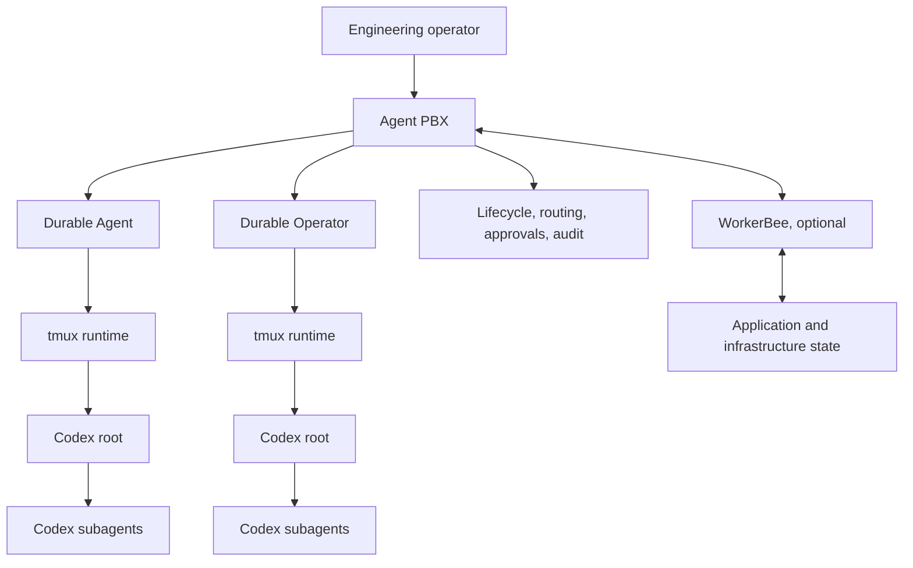

# Agent PBX architecture

Agent PBX is a **runtime-grounded Agentic Engineering Control Plane**. It gives
an engineering operator a durable system for operating Agent and Operator
runtimes across projects, Codex sessions, tmux terminals, model profiles,
campaigns, handoffs, approvals, and lifecycle changes.

The TUI is the primary local operator console. It is one interface to the
control plane rather than the durable system itself. Closing the TUI detaches a
client; it does not terminate a managed Codex process, discard tmux history, or
erase the Agent or Operator identity.

## Ownership boundary

| Layer | Responsibility |
|---|---|
| Agent PBX | Durable Agent and Operator identity, workspaces, topology, routing, policy, approvals, lifecycle, campaigns, handoffs, model profiles, and audit |
| Codex root | Reasoning, local planning, tool selection, code execution, testing, review, and bounded child delegation |
| Codex subagent | Ephemeral or task-scoped work owned by one Codex root; it does not become a PBX peer implicitly |
| tmux | PTYs, panes, sessions, persistence, geometry, attachment, pop in/out, and scrollback |
| WorkerBee | Optional application, platform, infrastructure, simulation, deployment, and runtime truth |
| TUI, SSH, HTTP/WSS, and MCP | Operator and integration surfaces over the same managed state |

The durable boundary matters during CLI updates, model changes, daemon and TUI
restarts, terminal movement, and remote attachment. Agent PBX reconciles the
PBX entity, project, Codex session evidence, tmux server/session/window/pane,
process identity, and active execution profile before it treats a runtime as
healthy.

## Runtime-grounded control

Agent PBX does not infer durable identity from a terminal title or a rendered
screen alone. A managed runtime binds several kinds of evidence:

- PBX Agent or Operator identity;
- project and workspace ownership;
- Codex thread or session identifiers when available;
- tmux server, session, window, pane, and process evidence;
- model, reasoning, verbosity, and managed profile;
- structured reports, events, hooks, transcript provenance, and lifecycle
  records.

Structured evidence wins when sources disagree. Transcript and terminal
inspection remain fallbacks, with explicit provenance, rather than becoming the
sole source of truth.

## Agentic Application Stack Operations

**Agentic Application Stack Operations**, shortened to **Agentic StackOps**, is
the engineering practice performed through Agent PBX. It includes architecture,
planning, Agent and Operator assignment, implementation, review, infrastructure
changes, deployment, runtime inspection, validation, and iteration.

The human performing that work is an **engineering operator**. A capitalized
PBX **Operator** is a durable coordination session with its own Codex root,
forks, campaign assignments, permissions, and lifecycle. The distinction keeps
human authority separate from a managed execution identity.

WorkerBee is optional. Without it, Agent PBX still manages projects, Codex
runtimes, tmux sessions, campaigns, knowledge, model profiles, GitHub, Joplin,
and lifecycle. With WorkerBee, the control loop can incorporate application and
infrastructure truth, simulation, deployment evidence, and post-change
validation.

## Native terminal topology

The v1 left/right TUI composition remains: Agents, Operators, and Events occupy
the left side, while the right side retains the complete tab row. When `Latest`
is selected, a focusable `PbxTerminalSurface` renders a normal tmux client
running on a child PTY. The runtime tmux server owns the real Codex pane and its
history; Textual renders the resulting terminal grid inside `Latest`.

Plain configured function keys remain Agent PBX navigation even when the
terminal is focused. Shift plus a function key sends the corresponding
unmodified function key to Codex. Ordinary keys, paste, mouse input, Escape,
Ctrl+C, and Ctrl+P belong to the terminal while it holds focus.

See [ADR 0002](adr/0002-tmux-terminal-topology.md) and
[ADR 0007](adr/0007-terminal-engine.md) for the terminal and rendering
decisions.

## Control surfaces

- **Local TUI:** full control and native embedded tmux interaction.
- **SSH attach:** full-fidelity remote terminal access without exposing a tmux
  socket over the network.
- **Remote TUI:** scoped observer or controller state over authenticated WSS,
  with independent client selection and drafts.
- **HTTP/WSS API:** lifecycle, event, and integration surface.
- **MCP:** structured Agent and Operator reporting, coordination, project
  context, campaigns, handoffs, and knowledge workflows.

No raw tmux socket or Codex app-server endpoint needs to be exposed to a LAN
client.

## Compatibility boundary

Agent PBX v2 prefers native tmux and sequenced events for local clients. Report
mode, explicit nohup polling, the Thread tab, HTTP refresh, and terminal capture
remain compatibility paths in Agent PBX 2.1.0. Their eventual removal requires
measured parity, migration evidence, a supported migration path, and published
notice.

The accepted architecture decisions are indexed in
[docs/adr/README.md](adr/README.md). Installation and migration guidance is in
[docs/install-v2.md](install-v2.md), and release acceptance evidence is in
[docs/acceptance/v2-uat.md](acceptance/v2-uat.md) and
[docs/acceptance/v2.1-uat.md](acceptance/v2.1-uat.md).
